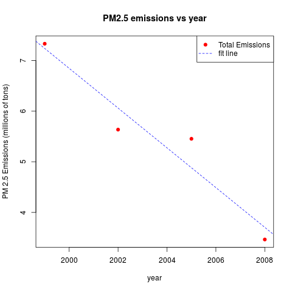
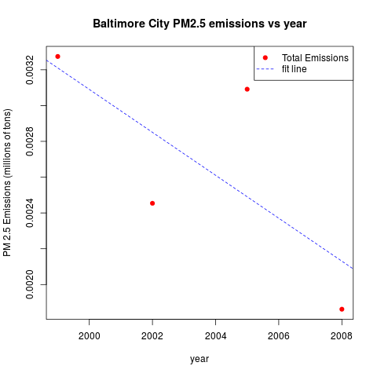
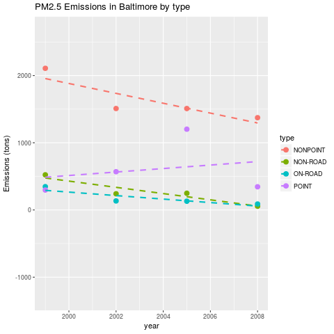
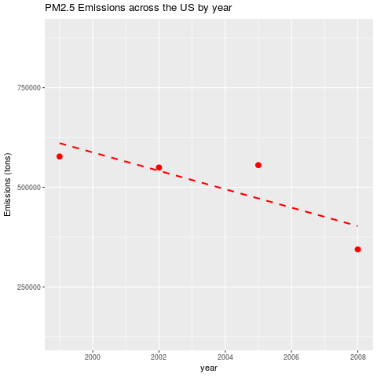
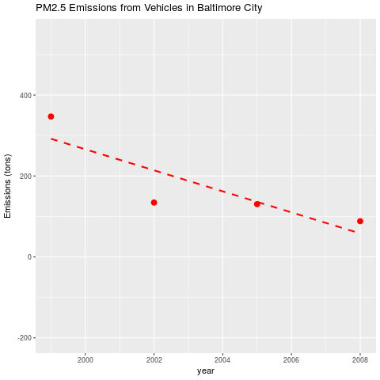
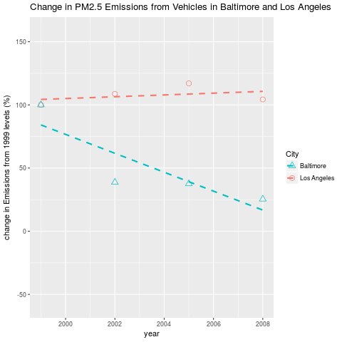

# ExploratoryDataAnalysisProject
week four project for exploratory data analysis course on coursera.org

## Question 1 : Have total emissions from PM2.5 decreased in the United States from 1999 to 2008? 

PM2.5 emissions *have* decreased. Total Emissions in 2008 are approximately half those of 1999, and the data shows a clear downward trend.

[plot1.R](./plot1.R)

## Question 2 : Have total emissions from PM2.5 decreased in the Baltimore City, Maryland (fips == "24510") from 1999 to 2008? 

PM2.5 levels in Baltimore have decreased since 1999. Levels have generally decreased since 1999 (aside from a spike on 2005), and the 2008 level is significantly lower than the 1999 value.

[plot2.R](./plot2.R)

## Question 3 : Of the four types of sources indicated by the type (point, nonpoint, onroad, nonroad) variable, which of these four sources have seen decreases in emissions from 1999–2008 for Baltimore City? Which have seen increases in emissions from 1999–2008?

Emissions from non-point, non-road, and on-road sources have decreased. Emissions from point sources have increased since 1999. 

[plot3.R](./plot3.R)

## Question 4 : Across the United States, how have emissions from coal combustion-related sources changed from 1999–2008?

Emissions from coal-related sources (those in which the SCC code contains "coal" or "lingnite" at level three or four) have decreased since 1999.

[plot4.R](./plot4.R)

## Question 5 : How have emissions from motor vehicle sources changed from 1999–2008 in Baltimore City?

PM2.5 emissions in Baltimore from vehiclular sources have decreased from 1999 to 2008.

[plot5.R](./plot5.R)

## Question 6 : Compare emissions from motor vehicle sources in Baltimore City with emissions from motor vehicle sources in Los Angeles County, California (fips == "06037"). Which city has seen greater changes over time in motor vehicle emissions?

The plot below shows the relative change in PM2.5 emissions from vehicles in Baltimore and Los Angeles, compared to the 1999 emission levels. Emissions in Los Angeles have been increasing since 1999, whereas in 2008 emissions in Baltimore had decreased to about 25% of their 1999 levels.

[plot6.R](./plot6.R)
